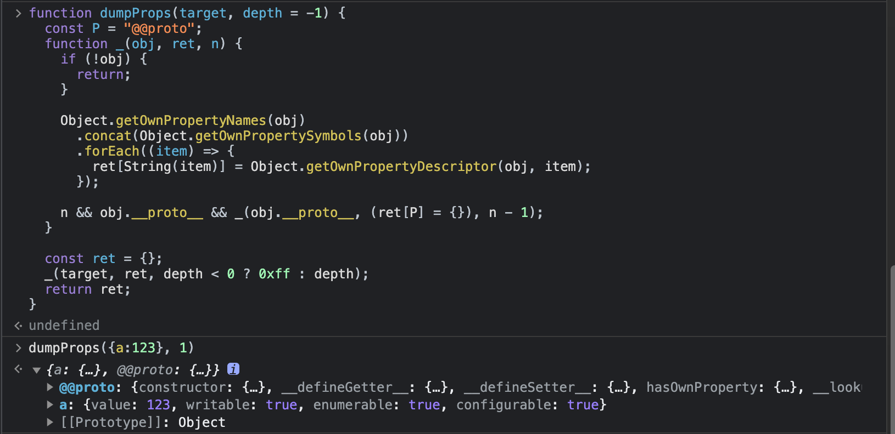

# dumpProps

This is a tool for dumping js object properties. During the debugging process, I often want to know what properties or methods an object has. The dump-props tool allows you to quickly know all the information about the object, including visible, invisible and Symbol.

## Install

```bash
npm install dump-props -g
```

## Usage

1. Execute in the console
```bash
dumpProps  
```

2. Paste the code (Ctrl + V) in the console of the developer tool or the debug console and execute it
3. If you want to see the object, you can directly call dumpProps



# Explain
```js
/**
 * show all properties of target
 * @param {*} target you want to dump
 * @param {*} depth dump depth, default -1, means dump all
 * @returns properties
 */
declare function dumpProps(target: any, depth:number): object;
```